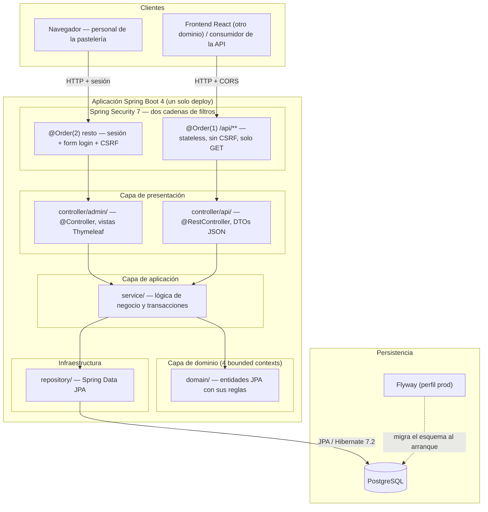
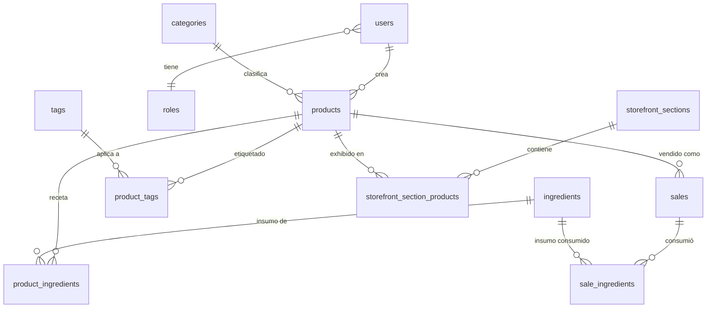
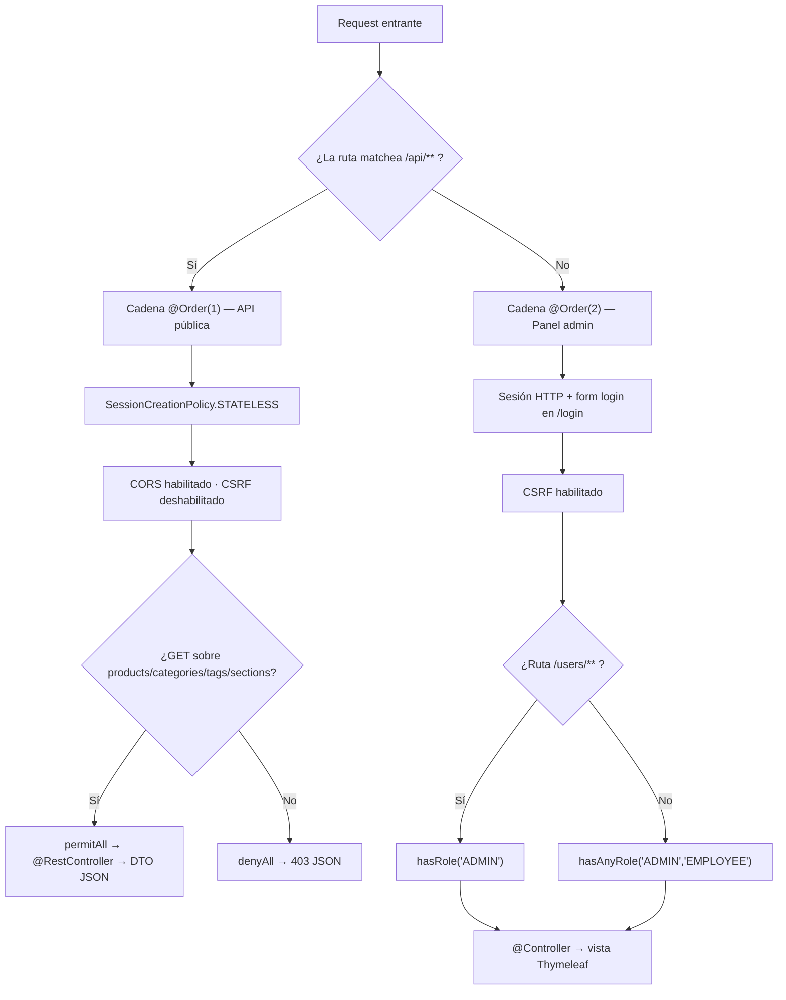
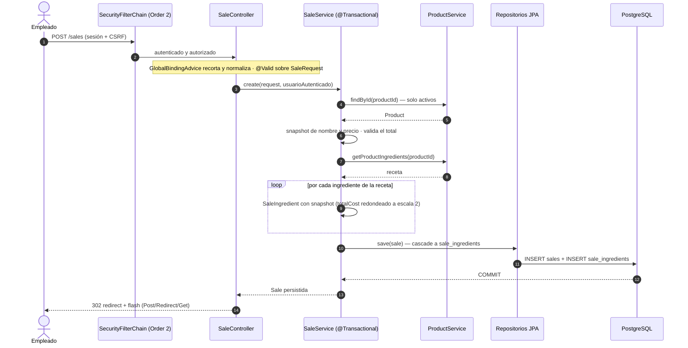

# 1. Arquitectura general

## Visión de capas

- **`domain/`** — el corazón: 12 entidades JPA agrupadas en **cuatro bounded
  contexts** (inventory, storefront, sales, auth) más dos superclases mapeadas
  (`TimestampedEntity`, `SoftDeletableEntity`). Las reglas que pertenecen a la
  entidad viven en la entidad: `softDelete()`, `restore()`, `isDeleted()`, el
  cálculo del `totalCost` en el constructor de `SaleIngredient`.
- **`service/`** — la lógica de negocio y la frontera transaccional
  (`@Transactional`). Un servicio valida, orquesta repositorios y traduce
  errores de dominio a excepciones con semántica (`EntityNotFoundException`,
  `IllegalArgumentException`, `IllegalStateException`). Lo que decide *si* una
  operación es legal vive acá, no en el controlador.
- **`controller/`** — capa de transporte fina, partida en dos por audiencia:
  `admin/` devuelve nombres de vista Thymeleaf, `api/` devuelve DTOs. Ninguno
  de los dos contiene reglas de negocio.
- **`repository/`** — interfaces de Spring Data JPA. La query se declara en el
  nombre del método y el plan de carga en `@EntityGraph`
  (ver [patrones](02-patrones-de-diseno.md#entitygraph-como-contrato-de-fetch)).

## Bounded contexts

La división no es por tipo técnico (todas las entidades en un paquete
`entity/`) sino por **significado en el negocio**. Cuatro contextos con
responsabilidades disjuntas:

| Contexto | Paquete | Entidades | Qué gobierna |
|---|---|---|---|
| **Inventory** | `domain/inventory/` | `Product`, `Category`, `Ingredient`, `ProductIngredient`, `UnitOfMeasure` | El catálogo interno, las recetas y el costo real |
| **Storefront** | `domain/storefront/` | `StorefrontSection`, `StorefrontSectionProduct`, `Tag`, `ProductTag` | Qué se muestra al público y cómo se organiza |
| **Sales** | `domain/sales/` | `Sale`, `SaleIngredient` | El registro histórico de lo vendido y lo consumido |
| **Auth** | `domain/auth/` | `User`, `Role`, `RoleType` | Quién entra al panel y qué puede hacer |

La frontera importa: `Product` vive en **inventory**, no en storefront, aunque
la vitrina lo muestre. La razón es de propiedad — el producto existe con
independencia de estar publicado (`visible` es un atributo suyo, no del
contexto público), y quien lo crea, lo costea y lo edita es la operación
interna. Storefront no *tiene* productos: tiene **decisiones de exhibición**
sobre ellos (`StorefrontSectionProduct` con su `displayOrder`, `ProductTag`).
Esa separación se corrigió durante el desarrollo: `Product` y `Category` se
movieron a inventory cuando quedó claro que estaban del lado equivocado de la
frontera.

## Panorama del modelo de datos

Tres decisiones de modelado que tiñen el resto del sistema:

- **La venta es un registro inmutable con snapshot.** `Sale` guarda
  `productName`, `unitPrice` y `totalAmount` *copiados* al momento de la venta,
  y `SaleIngredient` copia nombre, costo unitario, unidad y costo total de cada
  insumo consumido. La FK al producto y al ingrediente se conserva para
  trazabilidad, pero el reporte **no depende de ella**: si mañana sube la
  harina o se renombra un producto, la venta de ayer sigue contando lo que
  costó ayer. Un `JOIN` contra el catálogo actual daría márgenes históricos
  falsos.
- **El costo se calcula, no se guarda en el producto.** `Product` tiene
  `basePrice` (lo que se cobra) pero no un campo `cost`: el costo sale de
  recorrer su receta (`calculateRecipeCost`, `ProductService`). Un campo
  materializado quedaría desactualizado ante cualquier cambio de precio de un
  insumo, y el sistema no tiene aún el mecanismo para invalidarlo.
- **Soft-delete en las cinco entidades de catálogo** (`products`, `categories`,
  `ingredients`, `tags`, `storefront_sections`), no en las de registro ni en
  las de unión. Borrar una categoría es reversible; borrar una venta no debería
  ser posible en absoluto.

## Arquitectura de dos canales

El sistema atiende dos audiencias con necesidades opuestas y lo resuelve con
**dos cadenas de filtros de seguridad sobre un mismo dominio**
(`config/SecurityConfig.java`), no con dos aplicaciones:

Lo que hace que esto sea una decisión y no una casualidad: las dos cadenas
tienen **modelos de sesión incompatibles** y conviven porque están separadas.
La API es *stateless* y sin CSRF porque no hay nada que proteger —no tiene
cookies ni escrituras—; el panel es *stateful* con CSRF porque las tiene. Con
una sola cadena habría que elegir, y cualquiera de las dos elecciones sería
mala para la otra mitad del sistema.

El mismo criterio aplica al manejo de errores: `ApiExceptionHandler` es un
`@RestControllerAdvice` **acotado por paquete**
(`basePackages = "...controller.api"`), de modo que un `EntityNotFoundException`
sale como `404` con cuerpo JSON en la API, mientras que en el panel se traduce
a un redirect con mensaje flash. El mismo error, dos representaciones, según
quién lo va a leer.

## Recorrido de un request (de punta a punta)

Las piezas anteriores se ven mejor juntas. Registrar una venta desde el panel
(`POST /sales`) atraviesa, en orden:

1. **Cadena de seguridad.** La ruta no matchea `/api/**`, así que entra por la
   cadena `@Order(2)`: sesión válida, token CSRF válido, rol `ADMIN` o
   `EMPLOYEE`. Cualquiera de las tres cosas corta el request antes de tocar la
   lógica.
2. **Binding y validación del formulario.** `GlobalBindingAdvice`
   (`@ControllerAdvice` con `StringTrimmerEditor`) recorta espacios y convierte
   los strings vacíos en `null` **antes** de validar; después `@Valid` aplica
   las restricciones de Jakarta Validation sobre `SaleRequest`.
3. **Delegación al servicio.** `SaleController` no calcula nada: pasa el request
   y el `User` autenticado (`@AuthenticationPrincipal`) a
   `SaleService.create(...)`, anotado `@Transactional`.
4. **Resolución del producto y snapshot.** El servicio verifica que el producto
   exista y esté activo (`ProductService.findById` filtra por
   `deletedAt IS NULL`), y copia su nombre a la venta. El total se calcula y se
   valida contra los límites de la columna antes de persistir.
5. **Expansión de la receta.** Por cada `ProductIngredient` del producto se
   crea un `SaleIngredient` con `quantityUsed = cantidadReceta × cantidadVendida`
   y los snapshots de nombre, costo unitario y unidad. El `totalCost` se
   redondea a escala 2 en el constructor, porque el producto de una cantidad de
   escala 4 por un costo de escala 2 da escala 6 y la columna no lo admite
   (ver [caso 1](../03-producto/09-casos-de-estudio.md)).
6. **Persistencia en cascada.** Un solo `save` de la venta arrastra sus
   `SaleIngredient` por `cascade`; todo commitea o revierte junto.
7. **Post/Redirect/Get.** El controlador redirige con un `flash attribute`, de
   modo que un F5 no reenvía el formulario.

El resultado: el controlador es delgado, la transacción abarca la venta y todos
sus insumos, y el registro queda **cerrado sobre sí mismo** — legible sin
depender del estado actual del catálogo.

## Decisiones de arquitectura (y sus alternativas)

Las decisiones de fondo se tomaron contra alternativas concretas.

### Monolito por capas con DDD ligero, no arquitectura hexagonal

Un único deploy, cuatro capas (presentación → aplicación → dominio →
infraestructura) y bounded contexts marcados por paquete. La alternativa
canónica era **hexagonal / ports & adapters**: interfaces de repositorio
definidas en el dominio, entidades de dominio puras y entidades JPA separadas,
mappers entre ambas.

Se descartó por lo que costaba **en este sistema**: duplicar cada entidad en
dos representaciones y escribir el mapper entre ellas es un impuesto fijo que
se paga desde el primer día y solo se cobra cuando hace falta cambiar de
mecanismo de persistencia o testear el dominio sin base. Acá el dominio es
mayormente estructural (catálogo, receta, venta), no hay algoritmos de negocio
complejos que aislar, y no hay ningún escenario a la vista donde PostgreSQL se
reemplace. Se conservó lo que sí compra a este tamaño: **la lógica en el
servicio y no en el controlador**, y los contextos separados por paquete.

**Lo que la decisión cuesta**, y se asume: las entidades JPA están acopladas a
Hibernate (anotaciones, `LAZY`, proxies), y testear un servicio contra una base
en memoria o un fake requiere más ceremonia que con repositorios inyectados por
interfaz propia. Es la razón por la que hoy los tests de servicio usan mocks de
repositorio (ver [4. Calidad e ingeniería](04-calidad-e-ingenieria.md)).

### Panel SSR, no una SPA contra una API del panel

Decisión deliberada de **server-side rendering** con Thymeleaf + Layout Dialect
para el panel, y Tailwind/Flowbite para el estilo. La alternativa era el default
de la industria: una segunda SPA consumiendo una API JSON del panel.

Se descartó por tres costos concretos:

- **Duplicación de cada pantalla.** Con SPA, una vista existe dos veces: el
  contrato JSON del servidor y el render del cliente. Con SSR el markup vive una
  sola vez, y el fragmento reutilizable se factoriza con el Layout Dialect
  (`templates/layout/main.html`).
- **Un segundo modelo de autenticación.** El panel ya tiene sesión y CSRF
  resueltos por Spring Security con configuración declarativa. Una SPA
  necesitaría tokens, refresh y revocación: exactamente el andamiaje JWT/OAuth
  que este proyecto **eliminó** por no usarse
  (ver [caso 2](../03-producto/09-casos-de-estudio.md)).
- **Un segundo pipeline de build y un segundo deploy** para una aplicación cuyo
  público son dos usuarios internos.

**Lo que cuesta:** cada interacción es un round-trip completo al servidor, hay
que sostener CSRF en cada formulario, y una pantalla con estado local muy rico
sería incómoda. Para un panel de ABM, formularios y listados con filtros, el
intercambio es favorable.

El criterio no es dogmático, es situacional: **donde el consumidor no es el
panel, la API existe**. La vitrina pública se sirve por `/api/v1/**` con
contrato JSON documentado en OpenAPI, porque ahí el cliente es un frontend React
en otro dominio.

### Flyway en producción, `ddl-auto=create` en desarrollo

Dos estrategias de esquema, una por entorno (`application.properties` /
`application-prod.properties`):

| Entorno | Esquema | Datos |
|---|---|---|
| **dev** | `hibernate.ddl-auto=create` — Hibernate recrea el esquema en cada arranque | `DataSeeder` (`@Profile("dev")`) |
| **prod** | `ddl-auto=none` + Flyway (`validate-on-migrate=true`) | `R__seed_demo_data.sql` (migración repetible) |

La alternativa —Flyway también en desarrollo— daría una única representación del
esquema y eliminaría toda posibilidad de divergencia. Se prefirió el ciclo
rápido: en desarrollo el esquema se deriva de las entidades y una entidad nueva
no exige escribir la migración antes de probar la idea.

**El trade-off es real y conocido**: hay dos representaciones del esquema, y
solo una es la de producción. El sistema lo administra de tres maneras — el
`DataSeeder` de dev y el `R__seed_demo_data.sql` de prod se mantienen como
**espejo por construcción** (mismos datos, mismos hashes de contraseña, paridad
verificada), `spring.jpa.open-in-view=false` está activo **también en
desarrollo** precisamente para replicar el comportamiento de producción, y el
arranque real contra la cadena Flyway sobre PostgreSQL se verifica antes de
mergear. Aun así, es el punto más frágil del diseño y está declarado como tal
en [4. Calidad e ingeniería](04-calidad-e-ingenieria.md).

### `open-in-view=false`: la sesión se cierra en el servicio

Spring Boot deja `spring.jpa.open-in-view` en `true` por defecto: la sesión de
Hibernate sigue abierta durante el render de la vista, de modo que cualquier
proxy `LAZY` se resuelve solo. Es cómodo y es una fuente clásica de N+1
invisibles y de consultas disparadas desde la plantilla.

Acá está **desactivado en los dos perfiles**. La consecuencia es que la carga
deja de ser accidental y pasa a ser un contrato: cada consulta declara con
`@EntityGraph` qué relaciones necesita la vista que la consume. El costo es que
olvidarse produce una `LazyInitializationException` en el render — que fue
exactamente lo que ocurrió con las papeleras
(ver [caso 1](../03-producto/09-casos-de-estudio.md)). La ventaja es que el
problema aparece de golpe y se arregla en la consulta, en vez de degradar en
silencio a decenas de queries por página.

## Operación

- **Deploy** con Docker multi-stage en **Render** (web service + PostgreSQL
  administrado), definido como *blueprint* versionado en `render.yaml`.
- **Las migraciones corren al arranque** de la aplicación (Flyway con
  `validate-on-migrate=true`): una migración inconsistente rompe el boot del
  servicio, no la primera consulta que la necesite.
- **Perfiles** por variable de entorno (`SPRING_PROFILES_ACTIVE`), con
  `DataSeeder` restringido a `dev` por `@Profile` — el seed de desarrollo no
  puede ejecutarse en producción por construcción.
- **Keep-alive** con GitHub Actions para que la demo pública responda sin cold
  start, acotado a una ventana horaria por la restricción de horas del plan
  Free (ver [6. Stack y decisiones](../02-contexto-y-proceso/06-stack-tecnologico-y-decisiones.md)).
