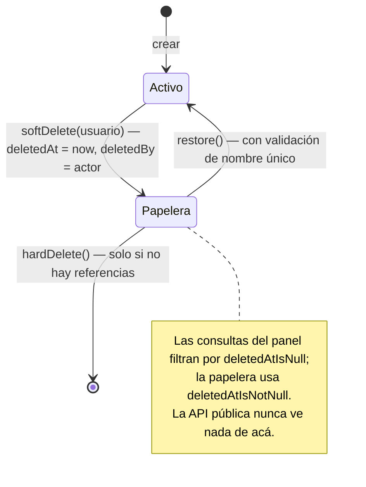

# 2. Patrones de diseño

Catálogo de los patrones aplicados en el sistema, con su ubicación real en el
código y el problema que resuelve cada uno. No son patrones "de manual"
aplicados por aplicarlos: cada uno existe porque un requisito concreto lo pidió,
y varios aparecieron como **fix sistémico** de un bug real
(ver [9. Casos de estudio](../03-producto/09-casos-de-estudio.md)).

## Índice

| # | Patrón | Dónde | Qué problema resuelve |
|---|---|---|---|
| | ***Integridad del registro histórico*** | | |
| 1 | [Snapshot en el registro de venta](#snapshot-en-el-registro-de-venta) | `domain/sales/Sale`, `SaleIngredient` | El margen histórico no puede depender del catálogo de hoy |
| 2 | [Soft-delete de tres fases](#soft-delete-de-tres-fases) | `domain/common/SoftDeletableEntity` | Un borrado accidental es reversible; el historial no se pierde |
| 3 | [Guarda de integridad antes del borrado](#guarda-de-integridad-antes-del-borrado) | `hardDelete` de los 5 servicios de catálogo | Traducir un rechazo de la FK en un mensaje, no en un error 500 |
| | ***Modelado del dominio*** | | |
| 4 | [Superclase mapeada (herencia de entidades)](#superclase-mapeada-herencia-de-entidades) | `domain/common/TimestampedEntity` → `SoftDeletableEntity` | Timestamps y auditoría de borrado sin repetirlos en 12 entidades |
| 5 | [Enum como value object](#otros-patrones-presentes) | `UnitOfMeasure`, `RoleType` | Estados ilegales inexpresables; `switch` cerrado sobre el conjunto |
| | ***Acceso a datos*** | | |
| 6 | [Repository con query derivada](#repository-con-query-derivada) | `repository/` (12 interfaces) | La intención de la consulta se lee en su nombre |
| 7 | [`@EntityGraph` como contrato de fetch](#entitygraph-como-contrato-de-fetch) | `ProductRepository` y las 5 consultas de papelera | Con `open-in-view=false`, la carga es explícita o falla |
| | ***Fronteras y audiencias*** | | |
| 8 | [Doble cadena de filtros](#doble-cadena-de-filtros-de-seguridad) | `config/SecurityConfig` | Dos modelos de sesión opuestos conviviendo en un deploy |
| 9 | [DTO segregado por audiencia](#dto-segregado-por-audiencia) | `dto/request/` (clases) vs `dto/response/api/` (records) | La entidad nunca cruza la frontera HTTP |
| 10 | [Advice transversal con alcance explícito](#advice-transversal-con-alcance-explícito) | `GlobalBindingAdvice`, `ApiExceptionHandler` | Normalizar y traducir errores una vez, no en cada handler |
| | ***Configuración y composición*** | | |
| 11 | [Seam de configuración por entorno](#seam-de-configuración-por-entorno) | `util/ImageUrlResolver` | Un comportamiento que cambia entre entornos, en un solo punto testeable |
| 12 | [Espejo dev/prod del seed](#espejo-devprod-del-seed) | `config/DataSeeder` + `db/migration/R__seed_demo_data.sql` | Dos rutas de datos que deben producir el mismo estado |
| 13 | [Inyección por constructor](#otros-patrones-presentes) | todos los servicios y controladores | Dependencias explícitas, finales y testeables sin contenedor |
| 14 | [Post/Redirect/Get + flash](#otros-patrones-presentes) | los 7 controladores de escritura del panel | Un F5 no reenvía el formulario |
| 15 | [Slug derivado](#otros-patrones-presentes) | `util/SlugUtil` + `TagService`, `StorefrontSectionService` | URLs públicas estables y legibles sin campo manual |

## Snapshot en el registro de venta

**Dónde:** `domain/sales/Sale.java`, `domain/sales/SaleIngredient.java`,
`service/sales/SaleService.java`

Una venta no guarda una referencia al producto y calcula todo por `JOIN`:
**copia** los valores que la definen en el momento en que ocurre.

`Sale` guarda `productName`, `unitPrice` y `totalAmount`. `SaleIngredient`
guarda, por cada insumo de la receta, `ingredientName`, `quantityUsed`,
`unitCost`, `unitOfMeasure` y `totalCost`. Las FKs a `products` e `ingredients`
se conservan para trazabilidad, pero ningún reporte depende de ellas.

El problema que resuelve es de **verdad histórica**: si sube el precio de la
harina o se renombra un producto, un reporte construido por `JOIN` reescribiría
retroactivamente el margen de todas las ventas pasadas. Con snapshot, la venta
de ayer sigue contando lo que costó ayer.

El corolario es que **la venta es un registro inmutable**: el panel expone
listar, ver detalle y crear (`SaleController`), pero no editar ni borrar. No es
una funcionalidad faltante — es la consecuencia de que un asiento histórico no
se corrige, y por eso las guardas de borrado permanente del catálogo protegen
las ventas y no al revés.

Detalle fino que costó un bug: `quantityUsed` tiene escala 4 y `unitCost`
escala 2, así que su producto tiene **escala 6** y no entra en la columna
`NUMERIC(12,2)`. El redondeo se hace en el constructor de `SaleIngredient`, no
en el llamador, para que **ninguna** ruta de creación pueda saltearlo — el
comentario del código lo documenta en el lugar donde importa.

## Soft-delete de tres fases

**Dónde:** `domain/common/SoftDeletableEntity.java` + los servicios de las cinco
entidades de catálogo

Las entidades de catálogo (`Product`, `Category`, `Ingredient`, `Tag`,
`StorefrontSection`) no se borran: se marcan. `deletedAt` nulo significa activo,
y `deletedBy` registra **quién** lo borró.



Dos detalles que separan esto de un flag booleano:

- **La restauración valida de nuevo la unicidad.** Restaurar un producto cuyo
  nombre fue reutilizado mientras estaba en la papelera fallaría contra la
  constraint; `ProductService.restore` lo detecta antes y lanza
  `IllegalStateException` con un mensaje accionable.
- **La creación explica el conflicto.** Si el nombre elegido pertenece a un
  elemento en la papelera, el mensaje no es "ya existe": es *"ya existe en la
  papelera; puedes restaurarlo o eliminarlo permanentemente antes de crear uno
  nuevo"*. El estado invisible del sistema se le explica al usuario en vez de
  dejarlo adivinando.

## Guarda de integridad antes del borrado

**Dónde:** `hardDelete` en `ProductService`, `CategoryService`,
`IngredientService`, `TagService`, `StorefrontSectionService`

El esquema declara las FKs hacia el catálogo con **`NO ACTION`**: una venta
conserva su producto, un `sale_ingredient` su ingrediente. Eso significa que un
borrado permanente de un elemento referenciado es **rechazado por la base**, y
sin guarda ese rechazo llega a la capa web como
`DataIntegrityViolationException` — es decir, como un **error 500** delante del
usuario.

El patrón: antes de `delete`, el servicio cuenta las referencias y, si las hay,
lanza `IllegalStateException` con el número exacto.

```java
long salesCount = saleRepository.countByProductId(id);
if (salesCount > 0) {
    throw new IllegalStateException(
        "No se puede eliminar permanentemente el producto porque tiene "
        + salesCount + " venta(s) registrada(s)");
}
```

La regla general que expresa: **cuando la base de datos ya conoce un
invariante, la aplicación lo verifica antes para poder explicarlo**. La
constraint sigue siendo la red final —nadie la quita— pero deja de ser el
mecanismo por el que el usuario se entera. Se aplicó a las cinco entidades a la
vez, no solo a la que falló
(ver [caso 1](../03-producto/09-casos-de-estudio.md)).

## Superclase mapeada (herencia de entidades)

**Dónde:** `domain/common/TimestampedEntity.java` y `SoftDeletableEntity.java`

```
TimestampedEntity  (@MappedSuperclass)
├── id, insertedAt, updatedAt
│
└── SoftDeletableEntity  (@MappedSuperclass)
    ├── deletedAt, deletedBy
    └── isDeleted(), softDelete(User), restore()
```

`@MappedSuperclass` —y no `@Inheritance`— porque no hay polimorfismo de
consulta: nadie pregunta "dame todas las entidades borrables". Lo único que se
comparte es **estructura y comportamiento**, no identidad, así que cada entidad
concreta mantiene su propia tabla sin columna discriminadora ni join.

El comportamiento vive en la superclase, no en los servicios: `softDelete(user)`
setea las dos columnas juntas. Un servicio no puede marcar `deletedAt` y
olvidarse de `deletedBy`.

## Repository con query derivada

**Dónde:** las 12 interfaces de `repository/`

Spring Data JPA deriva la consulta del nombre del método, y el proyecto lo
explota como **documentación ejecutable**: el filtro de soft-delete y el de
visibilidad son parte del nombre, así que no hay forma de leer una firma y no
saber qué devuelve.

```java
// Panel: activos
Page<Product> findByDeletedAtIsNull(Pageable pageable);

// Panel: papelera
Page<Product> findByDeletedAtIsNotNull(Pageable pageable);

// API pública: solo lo publicado y no borrado
Page<Product> findByVisibleTrueAndDeletedAtIsNull(Pageable pageable);
Optional<Product> findByIdAndVisibleTrueAndDeletedAtIsNull(Long id);
```

Que el filtro esté en el nombre importa para la seguridad de la superficie
pública: `findVisibleById` **no** es `findById` con un `if` después. Un producto
no visible o borrado no llega nunca al controlador de la API — el filtro está en
la consulta, no en una rama que alguien puede olvidar.

**El límite del patrón** está a la vista y es deliberado: la combinación de
filtros de la vitrina produce nombres como
`findByVisibleTrueAndNameContainingIgnoreCaseAndCategoryIdAndDeletedAtIsNull`,
y `ProductService.findVisibleProducts` los despacha con un `if/else` de cuatro
ramas. Es legible y correcto para dos filtros opcionales; un tercero justificaría
mover eso a `Specification` o a una query con parámetros nulos.

## `@EntityGraph` como contrato de fetch

**Dónde:** `ProductRepository` y las consultas de papelera de las cinco
entidades de catálogo

Con `spring.jpa.open-in-view=false` (ver
[1. Arquitectura](01-arquitectura.md#open-in-viewfalse-la-sesión-se-cierra-en-el-servicio)),
la sesión de Hibernate está cerrada cuando Thymeleaf renderiza. Un proxy `LAZY`
sin inicializar no se resuelve solo: revienta.

La respuesta es declarar el plan de carga en la consulta, junto a ella:

```java
// La vista de detalle muestra la categoría y el creador
@EntityGraph(attributePaths = { "category", "createdBy" })
Optional<Product> findByIdAndDeletedAtIsNull(Long id);

// deletedBy es obligatorio en el fetch: la vista muestra quién eliminó y con
// open-in-view=false un proxy lazy romperia el render de la plantilla.
@EntityGraph(attributePaths = { "category", "deletedBy" })
Page<Product> findByDeletedAtIsNotNull(Pageable pageable);
```

El segundo comentario es literal del repositorio, y está ahí porque su ausencia
fue un bug: las cinco papeleras devolvían **HTTP 200 con el HTML truncado** —el
fallo más incómodo posible, porque no aparece como error en ningún lado
(ver [caso 1](../03-producto/09-casos-de-estudio.md)).

Lo que el patrón compra: el N+1 deja de ser un accidente silencioso y pasa a ser
una decisión escrita al lado de la consulta que lo causa.

## Doble cadena de filtros de seguridad

**Dónde:** `config/SecurityConfig.java`

Dos beans `SecurityFilterChain` con `@Order` explícito y un `securityMatcher`
que los separa. El detalle completo está en
[3. Seguridad](03-seguridad.md#dos-cadenas-un-solo-deploy); como *patrón*, lo
que interesa es la forma: **cuando dos audiencias necesitan configuraciones
mutuamente excluyentes, se instancian dos configuraciones y se rutea entre
ellas**, en lugar de una configuración con condicionales.

La API es `STATELESS` sin CSRF y termina en `.anyRequest().denyAll()`; el panel
es sesión + CSRF + form login y termina en `.anyRequest().hasAnyRole(...)`. Cada
cadena es legible por sí sola y no hay ninguna rama que decida en runtime qué
política aplicar.

## DTO segregado por audiencia

**Dónde:** `dto/request/` (8 clases) y `dto/response/api/` (6 records)

La entidad JPA **nunca** cruza la frontera HTTP. Y las dos direcciones usan
construcciones distintas del lenguaje, a propósito:

| Dirección | Forma | Por qué |
|---|---|---|
| **Entrada** (`ProductRequest`, `SaleRequest`, …) | Clase Lombok mutable con anotaciones de Jakarta Validation | El binding de formularios de Spring MVC necesita constructor sin argumentos y setters; la validación declarativa vive con el campo |
| **Salida de API** (`ProductApiDTO`, `TagApiDTO`, …) | `record` de Java con `@Schema` de OpenAPI | Inmutable, sin ceremonia, y el contrato queda documentado en el tipo mismo |

Los records de respuesta llevan además **variantes anidadas** (`ProductApiDTO`
y `ProductApiDTO.Simple`): el listado devuelve la forma reducida y el detalle la
completa. Una sola clase con campos nulos serviría a las dos, pero el consumidor
del listado no podría saber qué campos esperar; dos tipos hacen el contrato
explícito y son gratis con records.

## Advice transversal con alcance explícito

**Dónde:** `config/GlobalBindingAdvice.java`,
`controller/api/ApiExceptionHandler.java`

Dos usos del mismo mecanismo de Spring para dos problemas distintos, y con
**alcances deliberadamente distintos**:

- **`GlobalBindingAdvice`** (`@ControllerAdvice` + `StringTrimmerEditor(true)`,
  **sin acotar**) recorta espacios y convierte `""` en `null` **antes** de que
  corra la validación. Nació de un bug concreto: editar un usuario sin cambiar la
  contraseña enviaba `""`, que violaba `@Size(min = 6)`, cuando la intención era
  "no la toques". Con `null`, la validación de campo opcional simplemente no se
  dispara. Se resolvió una vez para todos los formularios del panel en vez de un
  `if (password.isBlank())` por controlador. Al no llevar `basePackages` alcanza
  también a los parámetros de query de la API pública, donde `?name=` llega como
  `null` en lugar de un filtro vacío — el mismo saneamiento, aplicado al otro
  canal.
- **`ApiExceptionHandler`** (`@RestControllerAdvice` **acotado por paquete**)
  traduce excepciones a JSON con el status correcto: `EntityNotFoundException` →
  404, `IllegalArgumentException` → 400, cualquier otra → 500 con mensaje
  genérico (no se filtra el detalle interno al público). El `basePackages` es
  esencial: sin él, el advice también capturaría los errores del panel y le
  devolvería JSON a un navegador que espera HTML.

## Seam de configuración por entorno

**Dónde:** `util/ImageUrlResolver.java`

Las imágenes de producto se siembran con ruta relativa (`/images/products/x.webp`)
porque las sirve el propio backend. Un frontend React alojado en **otro dominio**
resuelve esa ruta contra su propio origen y muestra la imagen rota.

En vez de cambiar los datos sembrados (que rompería el panel, servido desde el
mismo origen) o de concatenar el prefijo en cada controlador, el proyecto aisló
la decisión en un componente de una sola responsabilidad, configurado por
propiedad:

```java
public ImageUrlResolver(@Value("${app.public.base-url:}") String baseUrl) {
    // Normalizar: sin espacios y sin barras finales para no duplicarlas al concatenar.
    this.baseUrl = baseUrl == null ? "" : baseUrl.strip().replaceAll("/+$", "");
}
```

Con la propiedad vacía (default) devuelve la ruta tal cual; con
`PUBLIC_BASE_URL` definida en Render antepone el origen. Además respeta las URLs
que ya son absolutas y los valores nulos o en blanco.

Es el patrón "una decisión, un punto, un test": los **7 tests** de
`ImageUrlResolverTest` cubren base vacía, base nula, ruta con y sin barra
inicial, base con barra final, URL ya absoluta, y null/blank. Ninguno necesita
levantar Spring.

## Espejo dev/prod del seed

**Dónde:** `config/DataSeeder.java` (`@Profile("dev")`) y
`db/migration/R__seed_demo_data.sql`

Los dos entornos llegan al mismo estado de datos por caminos distintos: en
desarrollo, un `CommandLineRunner` que usa los repositorios; en producción, una
**migración repetible** de Flyway que se re-ejecuta sola cada vez que cambia su
contenido, después de todas las versionadas.

Que sean dos implementaciones es una consecuencia inevitable de tener dos
estrategias de esquema. Que produzcan **el mismo estado** es una disciplina
explícita: mismos 50 productos, mismas 297 líneas de receta, mismas 42 ventas y
—crítico para la demo— **los mismos hashes BCrypt**, de modo que las credenciales
del README funcionen igual en local y en la instancia desplegada. El comentario
del `DataSeeder` lo declara:

> *Passwords de los usuarios demo. Coinciden con los hashes BCrypt sembrados en
> `R__seed_demo_data.sql` para que las credenciales del README sirvan tanto en
> local (perfil dev) como en la demo desplegada.*

`@Profile("dev")` es la otra mitad del patrón: el seeder de desarrollo **no
puede** ejecutarse en producción, porque el contenedor arranca con
`SPRING_PROFILES_ACTIVE=prod` y el bean ni siquiera se instancia.

## Otros patrones presentes

| Patrón | Dónde | Para qué |
|---|---|---|
| **Inyección por constructor** | todos los `@Service` y `@Controller` | Dependencias `final` y explícitas; un test las pasa a mano sin contenedor de Spring (es lo que hacen `UserServiceTest` y `UserControllerTest` con Mockito) |
| **Post/Redirect/Get + flash** | los 7 controladores de escritura del panel (48 usos de `RedirectAttributes`) | Tras un POST exitoso se redirige con `addFlashAttribute`; un F5 no reenvía el formulario y la URL resultante es compartible |
| **Enum como value object** | `UnitOfMeasure` (14 unidades con `displayName`), `RoleType` | El conjunto de valores válidos es cerrado y verificado por el compilador; `UnitOfMeasure` transporta además su representación de presentación, que la venta copia como snapshot |
| **Slug derivado** | `util/SlugUtil` + `TagService`, `StorefrontSectionService` | El slug se deriva del nombre (normaliza NFD, quita diacríticos, colapsa separadores) en vez de pedirlo al usuario: URLs públicas estables sin un campo más en el formulario. Al ser una transformación no inyectiva, el servicio valida el resultado —no vacío, no tomado, incluida la papelera— antes de persistirlo (ver [caso 7](../03-producto/09-casos-de-estudio.md)) |
| **Orden de exhibición autoasignado** | `StorefrontSectionService.addProductToSection` | Al agregar un producto a una sección toma `max(displayOrder) + 1`; el usuario no tiene que inventar un número para que la vitrina quede ordenada |
| **Autoridad desde el principal** | `@AuthenticationPrincipal User` en los controladores del panel | El actor de una venta o de un borrado sale de la sesión autenticada, nunca de un campo del formulario |
