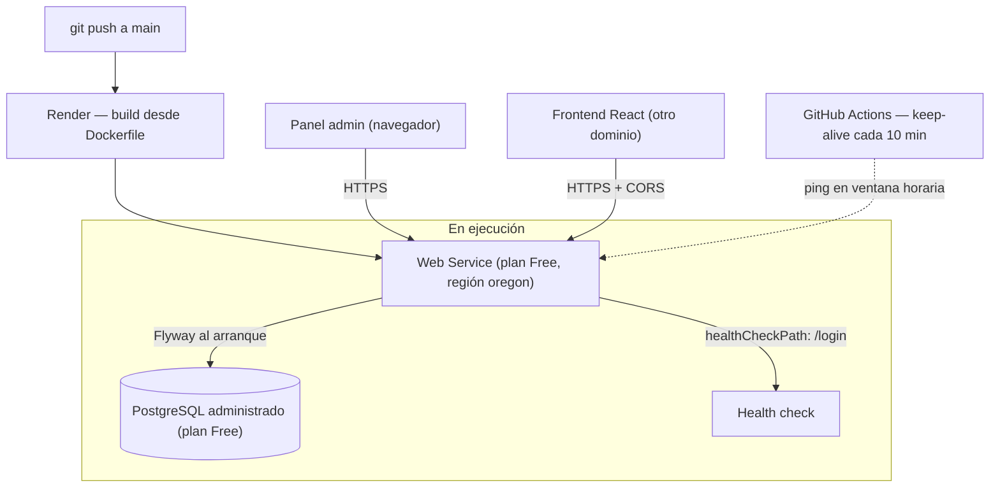

# 6. Stack tecnológico y decisiones de infraestructura

> Inventario de herramientas **con versión** y, sobre todo, el **porqué** de
> cada elección. Para las decisiones de alcance que enmarcan este stack ver
> [5. Contexto y objetivo](05-contexto-y-objetivo.md); para los patrones que
> habilita, [2. Patrones de diseño](../01-arquitectura-e-ingenieria/02-patrones-de-diseno.md).

## Lenguaje y framework

| Herramienta | Versión | Por qué |
|---|---|---|
| **Java** | 21 (LTS) | Versión de soporte extendido con `record`, pattern matching y texto multilínea ya estables. Los records son la forma de los DTOs de respuesta de la API: inmutables y sin ceremonia. |
| **Spring Boot** | 4.0.1 | La versión mayor actual. Autoconfiguración, perfiles por entorno y un modelo de arranque donde las migraciones y el seed cuelgan del ciclo de vida de la aplicación. Adoptarla en su primera línea es parte del objetivo del proyecto. |
| **Spring MVC** | (starter `webmvc`) | El panel es SSR con sesión: el modelo servlet clásico es el que corresponde, y es el que integra `@Controller`, binding de formularios, `RedirectAttributes` y Thymeleaf sin piezas intermedias. |
| **Spring Security** | 7.x | Cadenas de filtros componibles con `@Order` y `securityMatcher` — la pieza que hace posible atender dos audiencias con políticas opuestas en un solo deploy. |
| **Jakarta Validation** | (starter `validation`) | Validación declarativa en las entidades y los DTOs de entrada. La restricción vive junto al campo que restringe. |

**Por qué Spring Boot 4 y no quedarse en 3.x:** el objetivo declarado era
demostrar el stack actual, y el salto obliga a resolver los cambios de API de
Security 7 y de Hibernate 7.2 sin recetas ya escritas. Es trabajo real de
migración, que es precisamente lo que justifica una reescritura frente a un
mantenimiento.

**Por qué un monolito Spring y no un stack más liviano:** el sistema necesita
transacciones con cascada, mapeo objeto-relacional con control de fetch,
seguridad declarativa y renderizado en servidor. Ensamblar eso a mano cuesta
más que adoptar el framework que ya lo integra; el precio —opinión del framework
y arranque más pesado— se paga en un servicio de larga vida, no por request.

## Persistencia

| Herramienta | Versión | Por qué |
|---|---|---|
| **Spring Data JPA** | (starter) | Repositorios declarativos: la consulta se expresa en el nombre del método y el plan de carga en `@EntityGraph`. Menos SQL escrito a mano para el 90% de las consultas, con la puerta abierta a `@Query` para el resto. |
| **Hibernate** | 7.2 | Implementación JPA. Con `open-in-view=false`, su control de fetch pasa a ser explícito y auditable. |
| **PostgreSQL** | 13+ (y la instancia administrada de Render) | El mismo motor en local y en producción. Tipos `NUMERIC` con precisión y escala exactas para costos y cantidades de receta, FKs con comportamiento predecible, y `DO $$` para las migraciones de datos no triviales. |
| **Driver PostgreSQL** | `runtime` | Solo en tiempo de ejecución; no participa de la compilación. |
| **Flyway** | (starter + `flyway-database-postgresql`) | Migraciones versionadas con validación de checksum, migraciones repetibles para el seed, y ejecución al arranque. |

**Por qué `NUMERIC` y `BigDecimal` y no coma flotante:** el sistema multiplica
cantidades de receta por costos unitarios y suma márgenes. Con `double`, el
error de redondeo se acumula y un reporte de rentabilidad deja de cerrar. El
costo de esa elección es tener que respetar la escala de cada columna en el
código — y eso produjo dos bugs reales, ambos corregidos con validación explícita
(ver [caso 1](../03-producto/09-casos-de-estudio.md)).

**Por qué Flyway solo en producción:** discutido con su trade-off completo en
[1. Arquitectura](../01-arquitectura-e-ingenieria/01-arquitectura.md#flyway-en-producción-ddl-autocreate-en-desarrollo).
En corto: ciclo rápido en desarrollo a cambio de dos representaciones del
esquema, administrado con `open-in-view=false` en ambos perfiles, seed espejado
y verificación manual de la cadena Flyway antes de mergear.

## Frontend del panel (SSR)

| Herramienta | Versión | Por qué |
|---|---|---|
| **Thymeleaf** | 3.x | Plantillas HTML válidas que se abren en un navegador sin compilar. Integración nativa con el modelo de Spring MVC y con el binding de formularios. |
| **Thymeleaf Layout Dialect** | 3.3.0 | Herencia de plantillas: `layout/main.html` define el esqueleto (sidebar, cabecera, mensajes flash) y cada vista aporta su contenido. Sin él, 40 plantillas repetirían el mismo marco. |
| **thymeleaf-extras-springsecurity** | (starter) | `sec:authorize` en las plantillas: la UI no ofrece acciones que el servidor va a rechazar. Es ergonomía; el control real está en el backend. |
| **Tailwind CSS + Flowbite** | vía CDN | Estilo utilitario y componentes listos sin agregar Node ni un paso de build al pipeline. |
| **springdoc-openapi** | 2.3.0 | OpenAPI y Swagger UI generados desde las anotaciones de los controladores de la API, con `packages-to-scan` limitado a `controller.api`: el panel no aparece en la documentación pública. |

**Por qué Tailwind por CDN y no compilado:** mantiene el build en un solo paso
(`mvn package`) y el `Dockerfile` sin una etapa de Node. **Lo que cuesta**, y
está declarado: es una dependencia de un origen externo en tiempo de ejecución, y
es lo que impide hoy una Content-Security-Policy estricta
(ver [3. Seguridad](../01-arquitectura-e-ingenieria/03-seguridad.md#lo-que-el-sistema-no-tiene-y-por-qué)).
Servir los assets localmente es la tarea previa a esa mejora.

## Tooling y build

| Herramienta | Versión | Para qué |
|---|---|---|
| **Maven** | 3.9+ (con wrapper `mvnw` versionado) | Build reproducible: cualquiera clona y compila sin instalar Maven. |
| **Lombok** | (optional, con `annotationProcessorPaths`) | `@Getter`/`@Setter`/`@NoArgsConstructor` en entidades y DTOs de entrada. Excluido del artefacto final por configuración del `spring-boot-maven-plugin`: es una dependencia de compilación, no de runtime. |
| **JUnit 5 + Mockito + AssertJ** | (starters de test) | Tests unitarios con `@Nested` y `@DisplayName`, aserciones legibles. |
| **Starters de test segregados** | `data-jpa-test`, `validation-test`, `webmvc-test` | Spring Boot 4 partió el `spring-boot-starter-test` monolítico; el proyecto declara solo las porciones que usa. |

## Empaquetado: Docker multi-stage

`backend/Dockerfile`, dos etapas:

- **Builder** (`eclipse-temurin:21-jdk-alpine`): copia primero `.mvn/`, `mvnw` y
  `pom.xml`, corre `dependency:go-offline` y **recién después** copia `src/`. El
  orden importa: mientras el `pom.xml` no cambie, la capa de dependencias sale
  de caché y un cambio de código no re-descarga el árbol entero.
- **Runtime** (`eclipse-temurin:21-jre-alpine`): solo el JAR sobre un **JRE**,
  con usuario **no-root** (`spring:spring`) y `JAVA_OPTS` acotado
  (`-Xmx256m -Xms128m`) al plan de hosting.

El `ENTRYPOINT` resuelve dos variables del entorno con default: el puerto que
inyecta la plataforma (`${PORT:-10000}`) y el perfil
(`${SPRING_PROFILES_ACTIVE:-prod}`). El contenedor arranca correctamente aunque
la plataforma no defina nada, y en producción arranca en `prod` por defecto —de
modo que el `DataSeeder`, restringido a `@Profile("dev")`, no puede activarse
por un descuido de configuración.

**Por qué multi-stage:** la imagen final no lleva el JDK, ni Maven, ni el código
fuente, ni el repositorio local de dependencias. Menos superficie y menos tamaño.

## Infraestructura: Render

La plataforma se eligió por lo que el proyecto necesitaba de verdad:
**PostgreSQL administrado, deploy desde Docker, HTTPS automático y costo cero**.

| Pieza | Configuración | Por qué |
|---|---|---|
| **Web Service** | Docker, `rootDir: backend`, plan Free, región `oregon`, `branch: main` | Deploy automático al mergear a `main`: la rama de release **es** el disparador del despliegue. |
| **PostgreSQL administrado** | Plan Free, misma región | Backups y parches gestionados; misma región que el servicio para no pagar latencia entre zonas. |
| **Health check** | `healthCheckPath: /login` | Ruta pública que ejercita el stack completo (servlet + Security + Thymeleaf) sin requerir sesión. |
| **Variables de entorno** | Declaradas en `render.yaml`, credenciales con `fromDatabase` | La configuración es versionada y revisable; los secretos los inyecta la plataforma y nunca están en el repositorio. |

**Blueprint versionado.** `render.yaml` describe el servicio, la base y todas
sus variables en el repositorio. La infraestructura es código revisable en un
PR: un commit del historial elimina de ese archivo las variables de JWT y Google
que quedaron muertas tras retirar el andamiaje no implementado — el mismo cambio
tocó código, migración e infraestructura.

### La restricción económica, tratada como problema de ingeniería

El plan Free tiene dos límites que condicionan la demo:

1. **Spin-down a los 15 minutos** sin tráfico. El primer request después
   despierta el contenedor y tarda cerca de un minuto: para quien abre el enlace
   del README, el sistema parece caído.
2. **750 instance-hours mensuales por workspace.** Un mes de 31 días son 744
   horas: mantener el servicio despierto 24/7 deja **6 horas de margen**, y
   cualquier segundo servicio Free del mismo workspace agota el cupo y suspende
   **todo** hasta el mes siguiente.

La solución es un workflow de GitHub Actions (`.github/workflows/keep-alive.yml`)
que pinguea el servicio cada 10 minutos —por debajo de los 15 del spin-down—
**pero solo dentro de una ventana horaria** (09:00–01:00 hora argentina), lo que
consume unas 496 horas y deja margen holgado. El script (`scripts/keep-alive.sh`)
reintenta hasta tres veces con timeout de 90 segundos, porque un cold start de
Spring Boot en el plan Free tarda cerca de un minuto.

Tres detalles que muestran el nivel de cuidado, todos documentados en el propio
archivo:

- El `timeout-minutes: 8` del job está calculado sobre el peor caso del script
  (3 intentos × 90 s + 2 esperas × 15 s = 300 s), con la relación explicada en un
  comentario para que nadie lo baje sin mirar.
- El cron está en UTC y la ventana del script en hora argentina; el comentario
  documenta la equivalencia (`09:00-01:00 ART == 12:00-04:00 UTC`) y advierte que
  deben mantenerse sincronizados.
- `concurrency` sin `cancel-in-progress` evita acumular ejecuciones si un ping
  se solapa con el siguiente por un cold start lento, y `workflow_dispatch` con
  `--force` permite despertar el servicio a mano antes de mostrar la demo.

Es una restricción de presupuesto convertida en una solución acotada,
documentada y con sus supuestos escritos — no un cron pegado sin pensar.

## Hilo conductor de las decisiones

Tres criterios atraviesan todo el stack:

1. **Elegir para el problema que existe, no para el que podría existir.** Dos
   audiencias reales justifican dos cadenas de seguridad y dos formas de DTO; una
   sola pastelería no justifica multi-tenancy, y un dominio mayormente
   estructural no justifica arquitectura hexagonal.
2. **Que el default sea el seguro.** `denyAll()` al final de la cadena de la
   API, `@Profile("dev")` en el seeder, `prod` como perfil por defecto del
   contenedor, usuario no-root, Swagger apagado en producción. Olvidarse de algo
   debe fallar cerrado.
3. **Hacer explícito lo que el framework haría implícito** cuando lo implícito
   se degrada en silencio: `open-in-view=false` convierte un N+1 invisible en un
   error visible, y `@EntityGraph` convierte el plan de carga en una decisión
   escrita.
